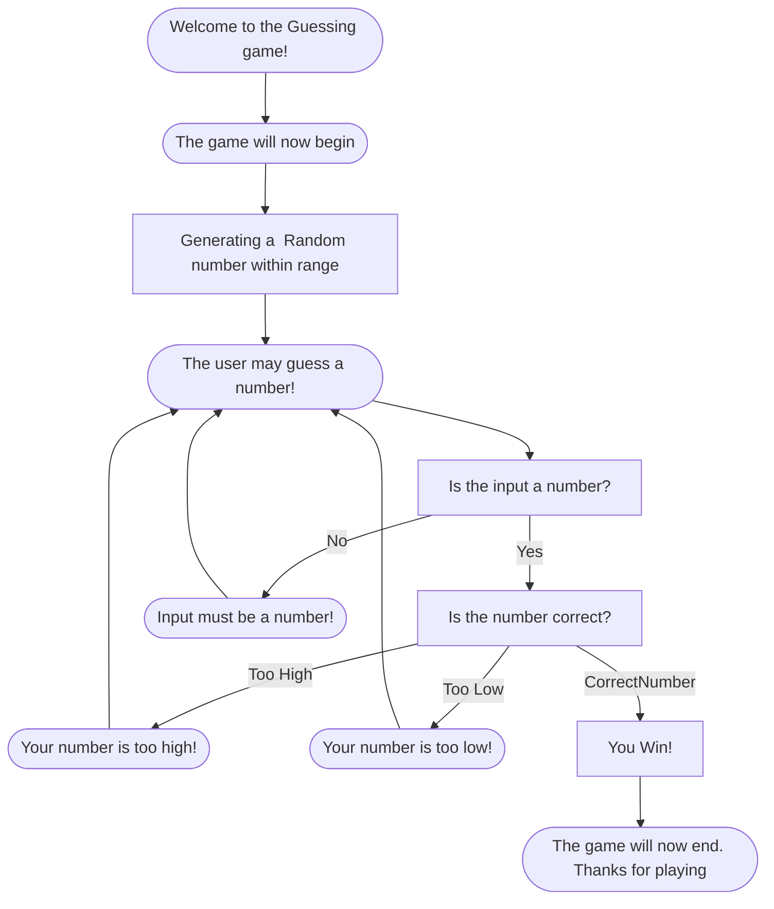

## Description
  The game first starts by welcoming the player and beginning the game by generating a number.
  After it generates a number, it then prompts the player to guess what that number is.
  Then it goes through a few processes to check the user's input

  ### Is it a number?
    The game first checks to see if the input is even a number, and if it isn't, it will prompt the player to try again.

  ### Is the number the correct answer?
    The game will then check to see if the number is correct to what has been generated.
    If the number is too high, it will tell the player and they can guess again.
    If the number is too low, it will tell the player and they can guess again.

  #### Winner!
    If the number is correct, then the player wins and the game will end!

